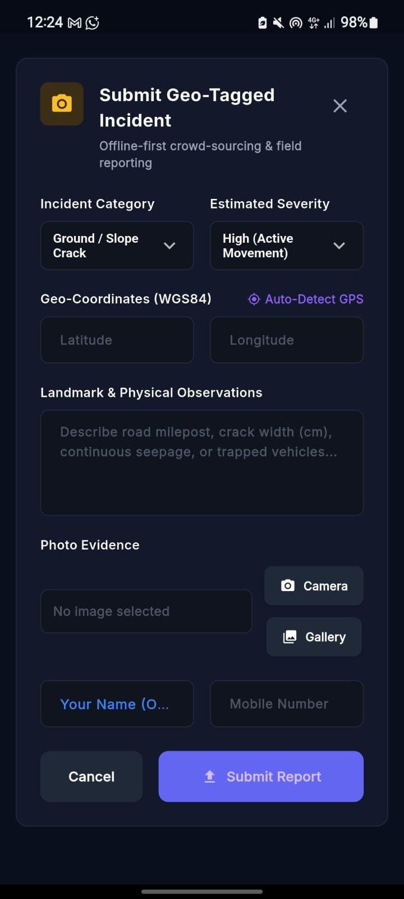
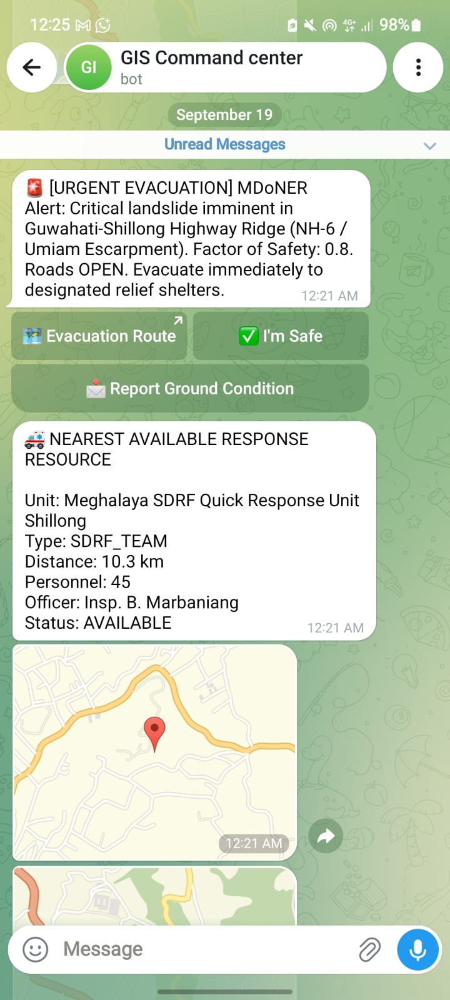

# 🚨 Landslide Nexus: Early Warning & Risk Monitoring System

### Ministry of Development of North Eastern Region (MDoNER) · SIH ID: **26001**

> **Status: PRODUCTION READY ✅**

An industry-grade, fully integrated geotechnical disaster monitoring and early-warning platform. Designed to protect and monitor vulnerable terrain across all **8 North Eastern Region (NER) states**.

---

## 📸 Platform Interface

| GIS Command Dashboard | Mobile Field App | Telegram Alert Bot |
| :---: | :---: | :---: |
|  |  |  |

---

## 🌟 Key Features

- **Real-Time IoT Ingestion**: Processes telemetry (tilt, moisture, pore-pressure) via MQTT.
- **AI & Geotechnical Physics**: Calculates Infinite Slope Factor of Safety (FoS), Rainfall Thresholds, and Sentinel-2 NDVI anomalies.
- **Multi-Lingual Alerting**: Automated SMS, WhatsApp, and Telegram dispatch in 6 regional languages during CRITICAL breaches.
- **Offline-First Mobile App**: Flutter application for citizen reporting and field officers with background sync.
- **Enterprise Architecture**: Built on FastAPI, PostGIS, Redis, and React.js, orchestrated via Docker and Kubernetes.

---

## 🚀 Quick Deploy (Docker Compose)

Spin up the complete containerized stack (Backend, Frontend, PostGIS, Redis, Mosquitto) with a single command:

```bash
cd deployment
docker compose up --build -d
```

| Service | Local URL |
|---------|-----------|
| 🗺️ GIS Dashboard | [http://localhost:3000](http://localhost:3000) |
| 📡 REST API (Swagger) | [http://localhost:8000/docs](http://localhost:8000/docs) |
| 🗄️ Database | `localhost:5432` |
| 📶 MQTT Broker | `localhost:1883` |

---

## 📚 Documentation & Setup

### 1. Environment Configuration
Copy the sample environment file and configure your API keys (Database, Telegram, SMS DLT, etc.):
```bash
cp .env.example backend/.env
```

### 2. Mobile App (Flutter)
Launch the mobile field application:
```bash
cd mobile
flutter pub get
flutter run
```

### 3. Automated Testing
Run the complete integration suite verifying the AI/physics engines and alert dispatch matrix:
```bash
py tests/test_integration_pipeline.py
```

---

## 🏛️ Tech Stack

- **Backend**: Python, FastAPI, SQLAlchemy
- **Databases**: PostgreSQL (PostGIS), Redis
- **Frontend**: React.js, Vite
- **Mobile**: Flutter
- **IoT & Infrastructure**: Eclipse Mosquitto, Docker, Kubernetes, NGINX

---

## 📜 License & Acknowledgements

Developed for the **Smart India Hackathon (SIH ID: 26001)**  
Ministry of Development of North Eastern Region **(MDoNER)** & National Disaster Management Authority **(NDMA)**.
